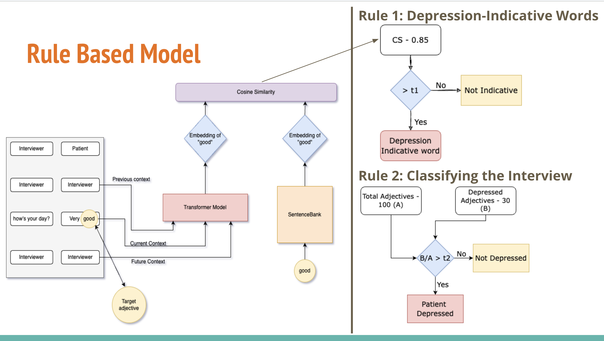
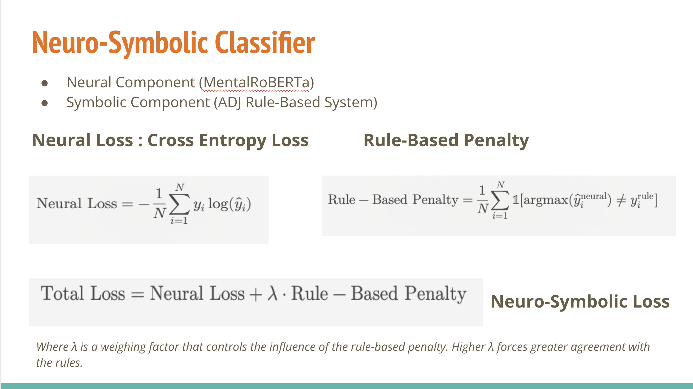
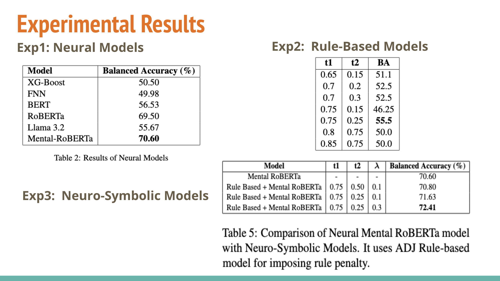

# Project Overview
Traditional machine learning models for depression classification lack interpretability 

We propose a neuro symbolic model that combines the strengths of deep learning models with the transparency of rule-based systems.

# Rule Based Model Architecture

# Neuro-Symbolic Loss Calculation

# Experimental Results

# Baseline Models: Code Re-run

## Mental-RoBERTa
### Go to implementation/baseline_models/mental-roberta/

In the file classification_mentalroberta_1stNov.ipynb
Following changes are needed to above file in order to re-run it:
1. /## Change the Directory Location 1

Change directory path to: './'

2. /## Change the Directory Location 2

change directory path to :  './datasets/Dataset'

3. /## Change the File Location 2 

change trained_models_base_dir path to: './'

After doing these changes, run the file to execute the code.

# Rule Based System: Code Re-run

### Go to implementation/rule-based/adjective/

In the file : RuleBasedSystem_DepressionAnalysis.ipynb

Search for the following comment and change the file address:

1. /## Change File location 1 

change file path to : ./datasets/DAIC demographc data.xlsx

2. /## Change File location 2

change file path to : ./datasets/DAIC demographc data.xlsx

3. /## Change File location 3

change file path to : ./datasets/train_split_Depression_AVEC2017.csv

4. /## Change File location 4

change file path to : ./datasets/test_split_Depression_AVEC2017.csv

5. /## Change Folder location 1

change folder path to : ./datasets/Dataset

6. /## Change File location 5

change file path to :   ./implementation/rule-based/adjective/embeddings/adjective_embeddings.pkl

After doing these changes, run the file to execute the code.

You will get a plot of Balanced Accuracy against all the combinations of t1 and t2 provided.

If you wish to change the values of t1 and t2, search for the list "parameters", and update the list as per your interest.

# Mental RoBERTA++: Code Re-run

### Go to implementation/neurosymbolic_models/adj_rule_plus_mental_roberta/
Go to:
implementation/neurosymbolic_models/adj_rule_plus_mental_roberta/

This directory contains two Jupyter notebooks for re-running the code with different \lambda values:
1. Neurosymbolic_Depression_Detection_5thDec.ipynb 

     
    Sets the \lambda parameter to 0.1.

    Focuses on a lower influence of the rule-based penalty in the hybrid loss function. 

2. Neurosymbolic_Depression_Detection_7thDec.ipynb 

    
     Sets the \lambda parameter to 0.3.
    
     Increases the influence of the rule-based penalty for tighter alignment with symbolic reasoning.

Following changes are needed to these files in order to re-run them:
1. /## Change the Directory Location 1

Change directory path to: './'

2. /## Change the File Location 1

change file path to : './implementation/rule-based/adjective/embeddings/adjective_embeddings.pkl'

3. /## Change the Directory Location 2

change directory path to :  './datasets/Dataset'

4. /## Change the File Location 2 

change trained_models_base_dir path to: './'

After doing these changes, run the file to execute the code.
If you wish to change the values of t1 and t2, search for the list "parameters", and update the list as per your interest.
Additionally, if you wish to update 'lambda' value, set 'lambda_weight' accordingly.

# Limitations Analysis

### Go to implementation/utils/

In the file : LimitationsAnalysis.ipynb

Search for the following comment and change the file address:

1. /## Change File location 1 

change file path to : ./datasets/DAIC demographc data.xlsx

2. /## Change File location 2

change file path to : ./datasets/train_split_Depression_AVEC2017.csv

3. /## Change File location 3

change file path to : ./datasets/test_split_Depression_AVEC2017.csv

4. /## Change Folder location 1

change folder path to : ./datasets/Dataset

5. /## Change File location 4

change file path to : ./datasets/depression_dataset_reddit_cleaned.csv

After doing these changes, run the file to execute the code to get the Noun, Adjective and Verbs count overlap between the Interview transcripts and SentenceBank dataset.

